# Метод BMad — Руководство пользователя

Это руководство поможет вам понять и эффективно использовать метод BMad для гибкого планирования и разработки на основе искусственного интеллекта.

## Рабочий процесс BMad: планирование и выполнение

Сначала рассмотрим полный стандартный рабочий процесс планирования и выполнения Greenfield. Brownfield очень похож, но рекомендуется сначала понять Greenfield, даже если речь идет о простом проекте, прежде чем приступать к проекту Brownfield. Метод BMad необходимо установить в корневую папку вашего нового проекта. На этапе планирования вы можете по желанию использовать мощные веб-агенты, что потенциально даст более качественные результаты при меньших затратах, чем если бы вы использовали свой собственный API-ключ или кредиты в некоторых инструментах Agentic. Для планирования лучшие результаты дают мощные модели мышления и более широкий контекст, а также сотрудничество с агентами.

Если вы собираетесь использовать метод BMad с проектом Brownfield (существующим проектом), ознакомьтесь с **[Работа в Brownfield](./working-in-the-brownfield.md)**.

Если приведенные ниже диаграммы не отображаются, установите Markdown All in One вместе с плагинами Markdown Preview Mermaid Support в VSCode (или один из форков). С этими плагинами, если вы щелкните правой кнопкой мыши по вкладке при открытии, должна появиться опция «Открыть предварительный просмотр», или проверьте документацию IDE.

### Рабочий процесс планирования (веб-интерфейс или мощные агенты IDE)

Перед началом разработки BMad следует структурированному рабочему процессу планирования, который в идеале выполняется в веб-интерфейсе для обеспечения экономической эффективности:

```mermaid
graph TD
    A["Начало: идея проекта"] --> B{"Необязательно: исследование аналитика"}
    B -->|Да| C["Аналитик: мозговой штурм (необязательно)"]
    B -->|Нет| G{"Доступно краткое описание проекта?"}
    C --> C2["Аналитик: исследование рынка (опционально)"]
    C2 --> C3["Аналитик: анализ конкурентов (опционально)"]
    C3 --> D["Аналитик: создание краткого описания проекта"]
    D --> G
    G -->|Да| E["PM: создание PRD на основе краткого описания (ускоренный процесс)"]
    G -->|Нет| E2["PM: интерактивное создание PRD (дополнительные вопросы)"]
    E --> F["PRD создан с FR, NFR, эпиками и историями"]
    E2 --> F
    F --> F2{"Требуется UX?"}
    F2 -->|Да| F3["UX-эксперт: создание спецификации фронт-энда"]
    F2 -->|Нет| H["Архитектор: создать архитектуру из PRD"]
    F3 --> F4["UX-эксперт: сгенерировать UI-подсказку для Lovable/V0 (необязательно)"]
    F4 --> H2["Архитектор: создать архитектуру из PRD + спецификации UX"]
    H --> Q{"Стратегия раннего тестирования? (необязательно)"}
    H2 --> Q
    Q -->|Да| R["QA: ранний ввод архитектуры тестирования в областях высокого риска"]
    Q -->|Нет| I
    R --> I["PO: запустить главный чеклист"]
    I --> J{"Документы согласованы?"}
    J -->|Да| K["Планирование завершено"]
    J -->|Нет| L["PO: обновить эпики и истории"]
    L --> M["Обновить PRD/архитектуру по мере необходимости"]
    M --> I
    K --> N["📁 переключиться на IDE (если используется веб-платформа агента)"]
    N --> O["PO: раздробить документы"]
    O --> P["Готово к циклу SM/Dev"]

    style A fill:#f5f5f5,color:#000
    style B fill:#e3f2fd,color:#000
    style C fill:#e8f5e9,color:#000
    style C2 fill:#e8f5e9,color:#000
    style C3 fill:#e8f5e9,color:#000
    style D fill:#e8f5e9,color:#000
    style E fill:#fff3e0,color:#000
    style E2 fill:#fff3e0,color:#000
    style F fill:#fff3e0,color:#000
    style F2 fill:#e3f2fd,color:#000
    style F3 fill:#e1f5fe,color:#000
    style F4 fill:#e1f5fe,color:#000
    style G fill:#e3f2fd,color:#000
    style H fill:#f3e5f5,color:#000
    style H2 fill:#f3e5f5,color:#000
    style Q fill:#e3f2fd,color:#000
    style R fill:#ffd54f,color:#000
    style I fill:#f9ab00,color:#fff
    style J fill:#e3f2fd,color:#000
    style K fill:#34a853,color:#fff
    style L fill:#f9ab00,color:#fff
    style M fill:#fff3e0,color:#000
    style N fill:#1a73e8,color:#fff
    style O fill:#f9ab00,color:#fff
    style P fill:#34a853,color:#fff
```



#### Переход от веб-интерфейса к IDE

**Критическая точка перехода**: после того, как PO подтвердит согласование документов, вы должны переключиться с веб-интерфейса на IDE, чтобы начать рабочий процесс разработки:

1. **Копирование документов в проект**: убедитесь, что файлы `docs/prd.md` и `docs/architecture.md` находятся в папке docs вашего проекта (или в пользовательском месте, которое вы можете указать во время установки).
2. **Переход к IDE**: откройте проект в предпочитаемой среде разработки Agentic IDE.
3. **Разбиение документов на фрагменты**: используйте агент PO для разбиения PRD, а затем Architecture на фрагменты.
4. **Начало разработки**: запустите цикл разработки ядра, который следует далее.

#### Планирование артефактов (стандартные пути)

```text
PRD              → docs/prd.md
Архитектура     → docs/architecture.md
Разбитые эпопеи    → docs/epics/
Разбитые истории  → docs/stories/
Оценки QA   → docs/qa/assessments/
Ворота QA         → docs/qa/gates/
```

### Основной цикл разработки (IDE)

После завершения планирования и фрагментации документов BMad следует структурированному рабочему процессу разработки:

```mermaid
graph TD
    A["Начало фазы разработки"] --> B["SM: просматривает заметки Dev/QA по предыдущей истории"]
    B --> B2["SM: подготавливает следующую историю из шардированного эпика и архитектуры"]
    B2 --> S{"Высокорисковая история? (необязательно)"}
    S -->|Да| T["QA: риск + дизайн по черновику истории"]
    S -->|Нет| B3
    T --> U["Создана тест-стратегия и профиль рисков"]
    U --> B3{"PO: валидировать черновик истории (необязательно)"}
    B3 -->|Требуется валидация| B4["PO: сверяет историю с артефактами"]
    B3 -->|Пропустить валидацию| C{"Подтверждение пользователя"}
    B4 --> C
    C -->|Одобрено| D["Dev: последовательное выполнение задач"]
    C -->|Нужны правки| B2
    D --> E["Dev: реализация задач и тестов"]
    E --> V{"Промежуточная проверка QA? (необязательно)"}
    V -->|Да| W["QA: trace или NFR для ранней валидации"]
    V -->|Нет| F
    W --> X["Dev: закрывает пробелы в покрытии/NFR"]
    X --> F["Dev: запускает все валидации"]
    F --> G["Dev: помечает готово к ревью и добавляет заметки"]
    G --> H{"Проверка пользователем"}
    H -->|Запросить QA-ревью| I["QA: ревью тест-архитектора и quality gate"]
    H -->|Одобрить без QA| M["ВАЖНО: проверить, что все регрессионные тесты и линтинг проходят"]
    I --> J["QA: анализ тест-архитектуры и активный рефакторинг"]
    J --> L{"Решение QA"}
    L -->|Нужна доработка Dev| D
    L -->|Одобрено| M
    H -->|Нужны исправления| D
    M --> N["ВАЖНО: закоммить изменения перед продолжением"]
    N --> Y{"Нужно обновить gate?"}
    Y -->|Да| Z["QA: обновляет статус gate"]
    Y -->|Нет| K
    Z --> K["Пометить историю как выполненную"]
    K --> B

    style A fill:#f5f5f5,color:#000
    style B fill:#e8f5e9,color:#000
    style B2 fill:#e8f5e9,color:#000
    style S fill:#e3f2fd,color:#000
    style T fill:#ffd54f,color:#000
    style U fill:#ffd54f,color:#000
    style B3 fill:#e3f2fd,color:#000
    style B4 fill:#fce4ec,color:#000
    style C fill:#e3f2fd,color:#000
    style D fill:#e3f2fd,color:#000
    style E fill:#e3f2fd,color:#000
    style V fill:#e3f2fd,color:#000
    style W fill:#ffd54f,color:#000
    style X fill:#e3f2fd,color:#000
    style F fill:#e3f2fd,color:#000
    style G fill:#e3f2fd,color:#000
    style H fill:#e3f2fd,color:#000
    style I fill:#f9ab00,color:#fff
    style J fill:#ffd54f,color:#000
    style K fill:#34a853,color:#fff
    style L fill:#e3f2fd,color:#000
    style M fill:#ff5722,color:#fff
    style N fill:#d32f2f,color:#fff
    style Y fill:#e3f2fd,color:#000
    style Z fill:#ffd54f,color:#000
```



## Необходимые условия

Перед установкой BMad Method убедитесь, что у вас есть:

- **Node.js** ≥ 18, **npm** ≥ 9
- **Git** установлен и настроен
- **(Необязательно)** VS Code с расширениями «Markdown All in One» + «Markdown Preview Mermaid Support»

## Установка

### Необязательно

Если вы хотите выполнять планирование в веб-браузере с помощью Claude (Sonnet 4 или Opus), Gemini Gem (2.5 Pro) или пользовательских GPT:

1. Перейдите в `dist/teams/`.
2. Скопируйте `team-fullstack.txt`.
3. Создайте новый Gemini Gem или CustomGPT.
4. Загрузите файл с инструкциями: «Ваши важные инструкции по эксплуатации прилагаются, не нарушайте характер, как указано».
5. Введите `/help`, чтобы увидеть доступные команды.

### Настройка проекта IDE

```bash
# Интерактивная установка (рекомендуется)
npx bmad-method install
```

## Специальные агенты

Существует два агента BMad — в будущем они будут объединены в один BMad-Master.

### BMad-Master

Этот агент может выполнять любые задачи или команды, которые могут выполнять все другие агенты, за исключением фактической реализации сценария. Кроме того, этот агент может помочь объяснить метод BMad в Интернете, обратившись к базе знаний и объяснив вам все о процессе.

Если вы не хотите переключаться между разными агентами, кроме разработчика, этот агент для вас. Просто помните, что по мере роста контекста производительность агента снижается, поэтому важно дать агенту указание сжать разговор и начать новый разговор с сжатым разговором в качестве начального сообщения. Делайте это часто, желательно после реализации каждого сюжета.

### BMad-Orchestrator

Этот агент НЕ должен использоваться в IDE, это тяжеловесный агент специального назначения, который использует много контекста и может превращаться в любой другой агент. Он существует исключительно для облегчения работы команд в веб-пакетах. Если вы используете веб-пакет, вас встретит BMad Orchestrator.

### Как работают агенты

#### Система зависимостей

Каждый агент имеет раздел YAML, который определяет его зависимости:

```yaml
dependencies:
  templates:
    - prd-template.md
    - user-story-template.md
  tasks:
    - create-doc.md
    - shard-doc.md
  data:
    - bmad-kb.md
```

**Ключевые моменты:**

- Агенты загружают только те ресурсы, которые им нужны (оптимизированный контекст)
- Зависимости автоматически разрешаются во время объединения
- Ресурсы совместно используются агентами для обеспечения согласованности

#### Взаимодействие агентов

**В IDE:**

```bash
# Некоторые IDE, такие как Cursor или Windsurf, используют ручные правила, поэтому взаимодействие осуществляется с помощью символа «@».
@pm Создать PRD для приложения управления задачами.
@architect Разработать архитектуру системы.
@dev Реализовать аутентификацию пользователей.

# Некоторые IDE, такие как Claude Code, вместо этого используют команды со слэшем.
/pm Создать пользовательские истории.
/dev Исправить ошибку входа в систему.
```

#### Интерактивные режимы

- **Инкрементный режим**: пошаговое выполнение с вводом данных пользователем.
- **Режим YOLO**: быстрое создание с минимальным взаимодействием.

## Интеграция с IDE

### Лучшие практики IDE

- **Управление контекстом**: храните только релевантные файлы в контексте, делайте файлы максимально лаконичными и сфокусированными.
- **Выбор агента**: используйте подходящего агента для задачи.
- **Итеративная разработка**: работайте над небольшими, целенаправленными задачами
- **Организация файлов**: поддерживайте чистую структуру проекта
- **Регулярное сохранение**: часто сохраняйте свою работу

## Тестовый архитектор (агент QA)

### Обзор

Агент QA в BMad — это не просто «старший разработчик-рецензент», а **архитектор тестирования** с глубокими знаниями в области стратегии тестирования, контроля качества и тестирования на основе рисков. Этот агент по имени Куинн предоставляет консультации по вопросам качества и активно улучшает код, когда это безопасно.

#### Быстрый старт (основные команды)

```bash
@qa *risk {story}       # Оценка рисков перед разработкой
@qa *design {story}     # Создание стратегии тестирования
@qa *trace {story}      # Проверка охвата тестированием во время разработки
@qa *nfr {story}        # Проверка атрибутов качества
@qa *review {story}     # Полная оценка → запись контрольного механизма
```

#### Псевдонимы команд (архитектор тестирования)

В документации для удобства используются сокращенные формы. Оба стиля являются допустимыми:

```text
*risk    → *risk-profile
*design  → *test-design
*nfr     → *nfr-assess
*trace   → *trace-requirements (или просто *trace)
*review  → *review
*gate    → *gate
```

### Основные возможности

#### 1. Профилирование рисков (`*risk`)

**Когда:** после составления чернового варианта истории, до начала разработки (самая ранняя точка вмешательства)

Выявляет и оценивает риски реализации:

- **Категории**: технические, безопасности, производительности, данных, бизнеса, эксплуатации
- **Оценка**: вероятность × анализ воздействия (шкала 1-9)
- **Смягчение**: конкретные стратегии для каждого выявленного риска
- **Влияние на этап**: риски ≥9 вызывают FAIL, ≥6 вызывают CONCERNS (см. `tasks/risk-profile.md` для авторитетных правил)

#### 2. Разработка тестов (`*design`)

**Когда:** после составления чернового варианта истории, до начала разработки (рекомендации по написанию тестов)

Создает комплексные стратегии тестирования, включая:

- Тестовые сценарии для каждого критерия приемлемости
- Рекомендации по соответствующему уровню тестирования (модульное, интеграционное или E2E)
- Приоритезация на основе рисков (P0/P1/P2)
- Требования к тестовым данным и стратегии моделирования
- Стратегии выполнения для интеграции CI/CD

**Пример результата:**

```yaml
test_summary:
  total: 24
  by_level:
    unit: 15
    integration: 7
    e2e: 2
  by_priority:
    P0: 8 # Must have - linked to critical risks
    P1: 10 # Should have - medium risks
    P2: 6 # Nice to have - low risks
```

#### 3. Отслеживание требований (`*trace`)

**Когда:** во время разработки (промежуточная проверка реализации)

Сопоставляет требования с охватом тестирования:

- Документирует, какие тесты проверяют каждый критерий приемки
- Использует Given-When-Then для ясности (только в документации, не в коде BDD)
- Определяет пробелы в покрытии с оценкой серьезности
- Создает матрицу отслеживаемости для целей аудита

#### 4. Оценка NFR (`*nfr`)

**Когда:** Во время разработки или раннего обзора (проверка качественных характеристик)

Проверяет нефункциональные требования:

- **Четыре основных**: безопасность, производительность, надежность, удобство обслуживания
- **Основанные на доказательствах**: поиск фактических доказательств реализации
- **Интеграция ворот**: сбои NFR напрямую влияют на ворота качества

#### 5. Комплексный обзор архитектуры тестирования (`*review`)

**Когда:** после завершения разработки, история помечена как «Готова к проверке»

При запуске `@qa *review {story}` Quinn выполняет:

- **Отслеживаемость требований**: сопоставляет каждый критерий приемки с соответствующими тестами
- **Анализ уровня тестирования**: обеспечивает надлежащее тестирование на уровне модулей, интеграции и E2E
- **Оценка покрытия**: выявляет пробелы и избыточное покрытие тестами
- **Активная рефакторинг**: напрямую улучшает качество кода, когда это безопасно
- **Решение о качестве**: выдает статус PASS/CONCERNS/FAIL на основе результатов

#### 6. Контроль качества (`*gate`)

**Когда:** после исправлений по результатам проверки или когда статус контроля качества требует обновления

Управляет решениями о качестве:

- **Детерминированные правила**: четкие критерии для PASS/CONCERNS/FAIL
- **Параллельная власть**: QA владеет файлами контроля в `docs/qa/gates/`
- **Рекомендательный характер**: дает рекомендации, а не блокирует
- **Поддержка отказов**: документирует принятые риски, когда это необходимо

**Примечание:** Контроль носит рекомендательный характер; команды выбирают свой уровень качества. WAIVED требует указания причины, утверждающего лица и даты истечения срока. См. `templates/qa-gate-tmpl.yaml` для схемы и `tasks/review-story.md` (правила контроля) и `tasks/risk-profile.md` для оценки.

### Работа с архитектором тестирования

#### Интеграция с рабочим процессом BMad

Архитектор тестирования обеспечивает ценность на протяжении всего жизненного цикла разработки. Вот когда и как использовать каждую возможность:

| **Этап**          | **Команда** | **Когда использовать**         | **Ценность**                  | **Результат**                                                     |
| ----------------- - | ----------- | ----------------------- | -------------------------- | ------------------------------- ------------------------------- |
| **Составление сценария** | `*риск`     | После того, как SM составил сценарий   | Раннее выявление подводных камней    | `docs/qa/assessments/{epic}.{story}-risk-{YYYYMMDD}.md`        |
|                    | `*design`   | После оценки рисков   | Руководство разработчикам по стратегии тестирования | `docs/qa/assessments/{epic}.{story}-test-design-{YYYYMMDD}.md` |
| **Разработка**    | `*trace`    | В середине реализации      | Проверка охвата тестированием       | `docs/qa/assessments/{epic}.{story}-trace-{YYYYMMDD}.md`       |
|                    | `*nfr`      | Во время создания функций | Раннее выявление проблем с качеством | `docs/qa/assessments/{epic}.{story}-nfr-{YYYYMMDD}.md`         |
| **Проверка**         | `*review`   | История помечена как завершенная   | Полная оценка качества    | Результаты QA в истории + файл контроля                                |
| **После проверки**    | `*gate`     | После устранения проблем     | Обновление решения о качестве    | Обновленный файл `docs/qa/gates/{epic}.{story}-{slug}.yml`              |

#### Примеры команд

```bash
# Этап планирования — запустите эти команды ДО начала разработки
@qa *risk {draft-story}     # Что может пойти не так?
@qa *design {draft-story}   # Какие тесты нам следует написать?

# Этап разработки — запустите эти команды ВО ВРЕМЯ кодирования
@qa *trace {story}          # Мы тестируем все?
@qa *nfr {story}            # Соответствуем ли мы стандартам качества?

# Этап проверки — выполнить по завершении разработки
@qa *review {story}         # Комплексная оценка + рефакторинг

# После проверки — выполнить после устранения проблем
@qa *gate {story}           # Обновить статус проверки
```

### Применяемые стандарты качества

Quinn применяет следующие принципы качества тестирования:

- **Отсутствие нестабильных тестов**: обеспечение надежности за счет правильной обработки асинхронных операций.
- **Отсутствие жестких ожиданий**: только динамические стратегии ожидания.
- **Безсостоятельность и параллельная безопасность**: тесты выполняются независимо.
- **Самоочистка**: тесты управляют своими собственными тестовыми данными.
- **Соответствующие уровни тестирования**: модульное тестирование для логики, интеграционное тестирование для взаимодействий, E2E для путей.
- **Явные утверждения**: утверждения должны находиться в тестах, а не в помощниках

### Значения статусов

- **PASS**: все критические требования выполнены, нет блокирующих проблем
- **CONCERNS**: обнаружены некритические проблемы, команда должна их проверить
- **FAIL**: критические проблемы, которые необходимо устранить (риски безопасности, отсутствующие тесты P0)
- **ОТМЕНЕНО**: проблемы признаны, но явно приняты командой

### Особые ситуации

**Истории с высоким риском:**

- Всегда запускайте `*risk` и `*design` перед началом разработки
- Рассмотрите возможность использования контрольных точек `*trace` и `*nfr` в середине разработки

**Сложные интеграции:**

- Запускайте `*trace` во время разработки, чтобы убедиться, что все точки интеграции протестированы
- Проведите проверку `*nfr`, чтобы подтвердить производительность всех интеграций

**Критическая производительность:**

- Запускайте `*nfr` на ранних этапах и часто во время разработки
- Не ждите до момента проверки, чтобы обнаружить проблемы с производительностью

**Браунфилд/устаревший код:**

- Начните с `*risk`, чтобы выявить опасности регрессии
- Используйте `*review`, уделяя особое внимание обратной совместимости

### Лучшие практики

- **Раннее вовлечение**: запускайте `*design` и `*risk` во время составления истории
- **Ориентация на риски**: пусть оценки рисков определяют приоритетность тестов
- **Итеративное улучшение**: используйте отзывы QA для улучшения будущих историй
- **Прозрачность контрольных точек**: делитесь решениями по контрольным точкам с командой
- **Непрерывное обучение**: QA документирует шаблоны для обмена знаниями в команде
- **Уход за существующими системами**: уделяйте особое внимание рискам регрессии в существующих системах.

### Справочник по путям вывода

Краткий справочник по местам хранения результатов работы Test Architect:

```text
*risk-profile  → docs/qa/assessments/{epic}.{story}-risk-{YYYYMMDD}.md
*test-design   → docs/qa/assessments/{epic}.{story}-test-design-{YYYYMMDD}.md
*trace         → docs/qa/assessments/{epic}.{story}-trace-{YYYYMMDD}.md
*nfr-assess    → docs/qa/assessments/{epic}.{story}-nfr-{YYYYMMDD}.md
*review        → раздел «Результаты QA» в файле истории + ссылка на файл шлюза
*gate          → docs/qa/gates/{epic}.{story}-{slug}.yml
```

## Система технических предпочтений

BMad включает систему персонализации через файл `technical-preferences.md`, расположенный в `.bmad-core/data/`. Это может помочь PM и архитектору рекомендовать ваши предпочтения в отношении шаблонов проектирования, выбора технологий или всего остального, что вы хотели бы здесь указать.

### Использование с веб-пакетами

При создании пользовательских веб-пакетов или загрузке на платформы искусственного интеллекта включите содержимое файла `technical-preferences.md`, чтобы агенты с самого начала любого разговора знали о ваших предпочтениях.

## Основная конфигурация

Файл `bmad-core/core-config.yaml` является важной конфигурацией, которая позволяет BMad беспрепятственно работать с различными структурами проектов. В будущем будет доступно больше опций. В настоящее время наиболее важным является раздел списка devLoadAlwaysFiles в yaml.

### Файлы контекста разработчика

Определите, какие файлы агент разработчика должен всегда загружать:

```yaml
devLoadAlwaysFiles:
  - docs/architecture/coding-standards.md
  - docs/architecture/tech-stack.md
  - docs/architecture/project-structure.md
```

Вам необходимо проверить, что эти документы существуют, что они максимально лаконичны и содержат именно ту информацию, которую вы хотите, чтобы агент разработчика ВСЕГДА загружал в свой контекст. Эти правила агент будет соблюдать.

По мере роста вашего проекта и появления в коде последовательных паттернов, стандарты кодирования должны быть сокращены, чтобы включать только те стандарты, которые агент по-прежнему должен применять. Агент будет анализировать окружающий код в файлах, чтобы определить стандарты кодирования, которые имеют отношение к текущей задаче.

## Получение помощи

- **Сообщество Discord**: [Присоединяйтесь к Discord](https://discord.gg/gk8jAdXWmj)
- **Проблемы GitHub**: [Сообщите об ошибках](https://github.com/bmadcode/bmad-method/issues)
- **Документация**: [Просмотрите документацию](https://github.com/bmadcode/bmad-method/docs)
- **YouTube**: [Канал BMadCode](https://www.youtube.com/@BMadCode)

## Заключение

Помните: BMad предназначен для улучшения вашего процесса разработки, а не для замены вашего опыта. Используйте его как мощный инструмент для ускорения ваших проектов, сохраняя при этом контроль над решениями по дизайну и деталями реализации.
